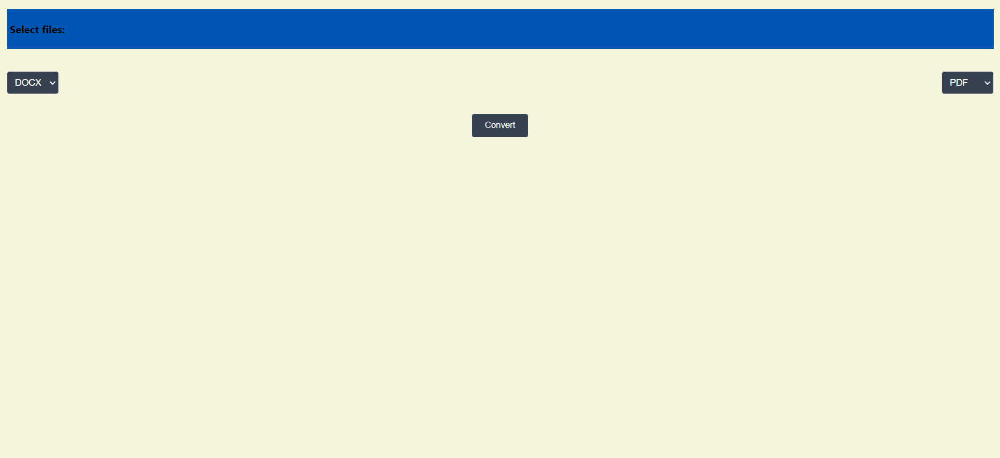

# Converter

# Table of Contents
- [Converter](#converter)
- [Table of Contents](#table-of-contents)
  - [Description](#description)
  - [Usage](#usage)
  - [Installation](#installation)
    - [1. Clone the Repository](#1-clone-the-repository)
    - [2. Create virtual enviroment for python](#2-create-virtual-enviroment-for-python)
    - [3. Run backend server](#3-run-backend-server)
    - [4. Run frontend server](#4-run-frontend-server)
    - [5. Run tests](#5-run-tests)
  - [Contributing](#contributing)
  - [License](#license)

## Description

This is a webapp written in reactjs and django. You can convert such formats as pdf, docx, doc.


## Usage

1. Select the file format to be converted on the left
2. On the right, select the file format to be converted to
3. Press `Select files:` and select your files
4. Press Convert button 
5. Open `converted.zip` with your converted files

## Installation

Follow these steps to get started

### 1. Clone the Repository
```bash
    git clone https://github.com/Vasya-556/Converter.git
    cd Converter
```

### 2. Create virtual enviroment for python
```bash
python -m venv env
# On Windows
env\Scripts\activate
# On macOS/Linux
source env/bin/activate
cd backend
pip install -r requirements.txt
```

### 3. Run backend server
```bash
cd backend
python manage.py migrate
python manage.py runserver
```

### 4. Run frontend server
```bash
cd frontend
npm start
```

### 5. Run tests
```bash
#for backend
python backend/manage.py test tests
#for frontend
cd frontend
npm test
```


## Contributing

Pull requests are welcome.

## License

[MIT](LICENSE)